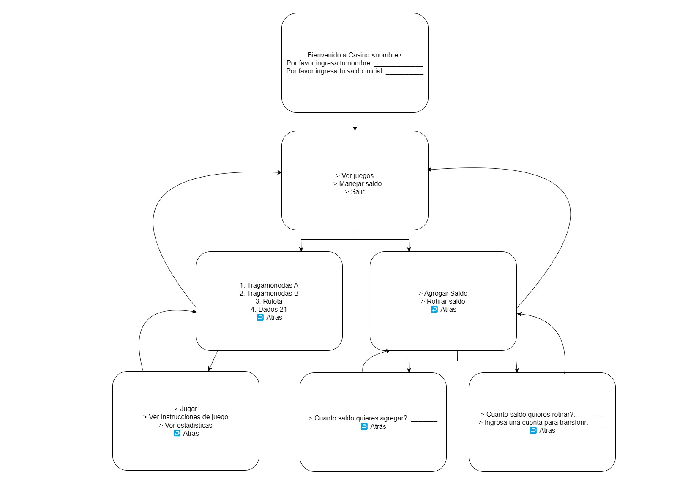

# CASINO <nombre> - Trabajo Final Programación

## Menu de navegación (propuesta #1)

## Modelos de clases

### Interfaz `IJuego`

### Clase abstracta `Juego`

### Clase `Jugador`

### Clase `Casino`

### Clase utilitaria `Menu`

## Guia para implementar un `Juego` nuevo

1. Crear una nueva clase que extienda `Juego`
2. Implementar los métodos de la interfaz `IJuego`
3. Validación y Pruebas
